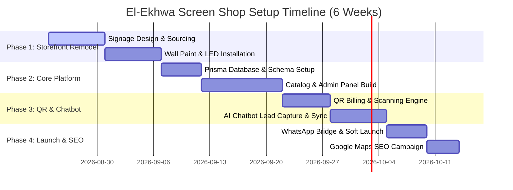

# Project Roadmap & Execution Timeline / خارطة الطريق والجدول الزمني للتنفيذ
**Project / المشروع:** El-Ekhwa Screens & Repair / الأخوة للشاشات والصيانة  
**Date / التاريخ:** August 2026 / أغسطس 2026  

---

## 1. Roadmap Overview / نظرة عامة على الجدول الزمني

We propose a compressed 6-week execution timeline to deliver both the storefront facelift and the complete digital software system, allowing the client to quickly capture new revenues and offset the installation costs.

---

## 2. Detailed Execution Phases / تفاصيل مراحل التنفيذ

### Phase 1: Storefront Remodeling & Branding (Weeks 1-2)
*   **Signage & Prints (Week 1):**
    *   Design the vector graphic files for the new dark charcoal signboard and the large QR code vinyl sticker.
    *   Acquire the domain name (e.g. `screens-hadayek.com`).
    *   Order the customized flex skin or Alucobond panels from a Giza supplier.
*   **Civil & Lighting Works (Week 2):**
    *   Plaster, clean, and paint the left wall and columns in waterproof matte charcoal.
    *   Mount the main signboard on the existing metal structure.
    *   Install the LED neon strip lines and wire the high-brightness backlight system.
    *   Mount the dummy 55-inch TV display casing and fix the interactive QR code vinyl sheet.

### Phase 2: Database Setup & Core Portal Development (Weeks 3-4)
*   **Backend & DB Layer (Week 3):**
    *   Instantiate the PostgreSQL database on Supabase.
    *   Apply the Prisma migration matching the `Customer`, `Screen`, and `RepairJob` tables.
    *   Configure secure environment variables on Vercel for database connectivity.
*   **Frontend Development (Week 4):**
    *   Build the responsive client catalog page where users can search available warehouse screen inventory.
    *   Create the simple repair booking intake form (where customers can request a technician checkup).
    *   Create the secure clerk/technician dashboard to list, search, and edit repair jobs.

### Phase 3: QR Financial Engine & AI Chatbot Integration (Week 5)
*   **QR Scanner & Bookkeeping (Days 1-3):**
    *   Implement the Node.js backend route to generate dynamic QR codes based on ticket IDs.
    *   Design the `/repair/[id]` status page featuring the step-by-step progress tracker.
    *   Build the authenticated `/admin/jobs/[id]` endpoint allowing technicians to scan-to-update.
*   **AI Chatbot & Sync (Days 4-7):**
    *   Write the OpenAI integration script to parse client questions.
    *   Hook the bot into the database to check live screen stock.
    *   Validate the lead collection flow, saving client details automatically in the PostgreSQL `Customer` table.

### Phase 4: WhatsApp Static Bridge, Testing & SEO Launch (Week 6)
*   **WhatsApp Bridge & Soft Launch (Days 1-3):**
    *   Build the static HTML bridge generation script (`wa-repair-[id].html`) to allow 100% reliable link sharing on WhatsApp.
    *   Conduct dry-run tests: creating a repair job, scanning the printed QR code with a phone, paying, and updating the status.
*   **Google Maps & Local Marketing (Days 4-6):**
    *   Create or claim the Google Business Profile named: **"الأخوة لصيانة وبيع الشاشات بحدائق الأهرام"**.
    *   Optimize description, upload photos of the newly remodeled modern storefront, and pin the shop.
    *   Initiate Google Maps Local Ads targeting searchers within Hadayek Al-Ahram and neighboring areas (Giza, Pyramids, October City).
