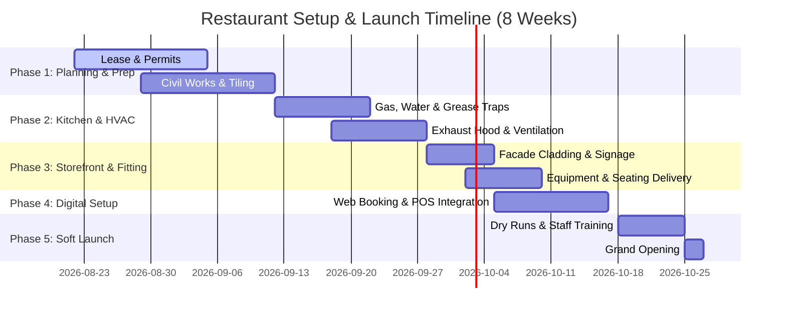

# Project Roadmap & Execution Timeline
**Date:** August 2026  
**Project:** Hadayek Al-Ahram Seafood Restaurant (150 m² Space)

This roadmap outlines a realistic, 8-week schedule (approx. 2 months) to fit out the 150 m² corner shop and launch its digital systems.

---

## Roadmap Overview

---

## Detailed Phases

### Phase 1: Planning, Permitting & Civil Works (Weeks 1-2)
*   **Administrative Tasks:**
    *   Sign the lease contract for the 150 m² unit on Al-Awadi Street.
    *   Submit documents for commercial registration, tax card, and water/electricity contract conversion to commercial tariffs.
*   **Civil Works:**
    *   Demolition of non-load-bearing walls to open up the dining area.
    *   Tiling the walls and floors of the kitchen and fish washing rooms with anti-slip, easy-clean ceramic tiles.
    *   Initial framing for the partition wall between the hot kitchen, raw prep area, and the dining room.

### Phase 2: Kitchen Infrastructure & Air Conditioning (Weeks 3-4)
*   **Mechanical & Plumbing:**
    *   Install main grease traps (mandated by health codes) and run copper commercial gas lines.
    *   Upgrade electrical outlets to three-phase power for heavy cooling loads (freezers, display counters, and ACs).
*   **Ventilation Systems:**
    *   Fabricate and hang the 3-meter stainless steel kitchen exhaust hood.
    *   Route the extraction ducting up the side of the building to the roof to prevent fish-frying odors from affecting residents.
    *   Install copper piping and drainage for the dining area's 5 HP air conditioning unit.

### Phase 3: Storefront & Furniture Assembly (Weeks 5-6)
*   **Exterior Design:**
    *   Mount the matte navy-blue Alucobond cladding panels on the continuous concrete lintel beam.
    *   Install the double-sided backlit LED signage and the corner logo emblem above the corner column.
*   **Interior Fitting:**
    *   Deliver and position the heavy-duty gas grill, deep fryers, upright freezer, and prep tables.
    *   Install the double-glazed fresh fish ice display window behind Shutter 3.
    *   Assemble and arrange the dining room's 8 tables and 24 chairs.

### Phase 4: Digital Deployments & System Sync (Week 7)
*   **Portal Deployment:**
    *   Deploy the Next.js portal on Vercel with the online menu and table/pre-order reservation engine.
    *   Configure the **WhatsApp Static HTML Bridge** (`wa-preview.html`) for reliable link sharing.
*   **AI Backend Integration:**
    *   Install and connect the POS register tablets.
    *   Train the AI Client on initial inventory templates (shelf-life alerts, automated supplier sheets).
    *   Link the cashier register with Talabat and elmenus webhooks to aggregate orders.

### Phase 5: Staff Training & Grand Opening (Week 8)
*   **Dry Runs (Days 1-5):**
    *   Conduct raw material purchasing trials at Obour Market.
    *   Train kitchen staff on portioning, cooking speeds, and hygiene standards.
    *   Run test dine-in seatings for family, friends, and selected Al-Hadaeq Club members to test kitchen-to-table workflows.
*   **Grand Opening (Days 6-7):**
    *   Launch full delivery services on Talabat and elmenus.
    *   Execute targeted local Facebook/Instagram campaigns highlighting the dine-in experience.
    *   Trigger automated WhatsApp review requests to build our Google Maps ranking.
